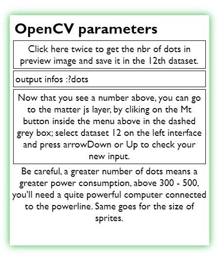

Projet combinatoire du répo [colokinetype (v.1)](https://github.com/rbottura/colorkinetype).
Cobining project from [colokinetype (v.1)](https://github.com/rbottura/colorkinetype) repo.  

Live [DEMO](https://esad-gv.net/designgraphique/DG5-REN5/Raphael_Bottura/ColorKineType/)

# ColorKineType (v.2.0.0) [FR.]
- **Text Parameters** :  

  
  
Panneau d'entrée du texte dans une text area, avec quelques paramètres pour customiser.   

- **Grid parameters** :  

  

La grille blanche qui apparait devant le texte prend deux paramètres, l'épaisseur des lignes blanches et l'espace qui les sépares.

- **OpenCV parameters** :  

  
 
Ce troisième panneau comporte un bouton qui permets de sauvegarder l'image en arrière plan, et la traité avec OpenCV pour compter les points noires, obtenir les coordonnées x et y et les stocker dans une array à 3 dimensions **[texte ou caractère][point][x, y]**

Une fois le bouton cliqué, le comptage fait, le nombre de points comptés est affiché dans le 3e panneau.

En plaçant son curseur en haut au centre de l'écran, on trigger l'apparition d'un menu pour naviguer entre les couches. P5 pour à la fois du texte et une grille blanche dans un élément canvas; Mt pour le rendue avec matter.js et son moteur physique, et Ry pour une future manipulation des paramètres en rythme et potentiellement en musique. 

  

Voici, ci-dessous un screenshot du rendu obtenu avec les paramètres présentés ci-dessus. 

# ColorKineType (v.2.0.0) [EN.]  
to be done.